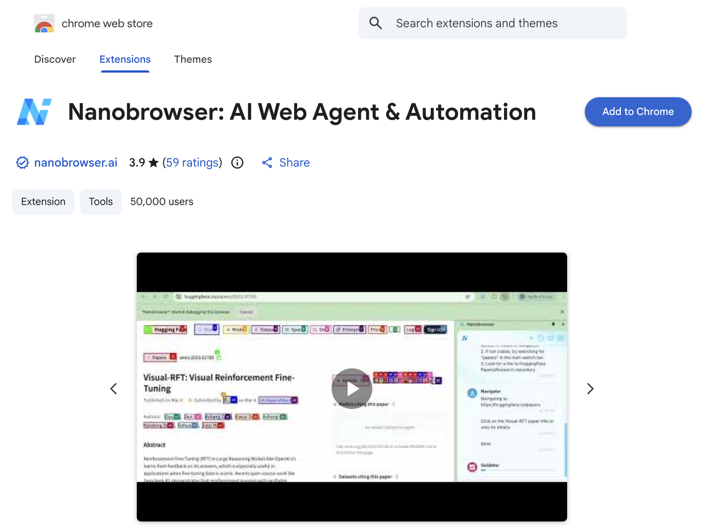
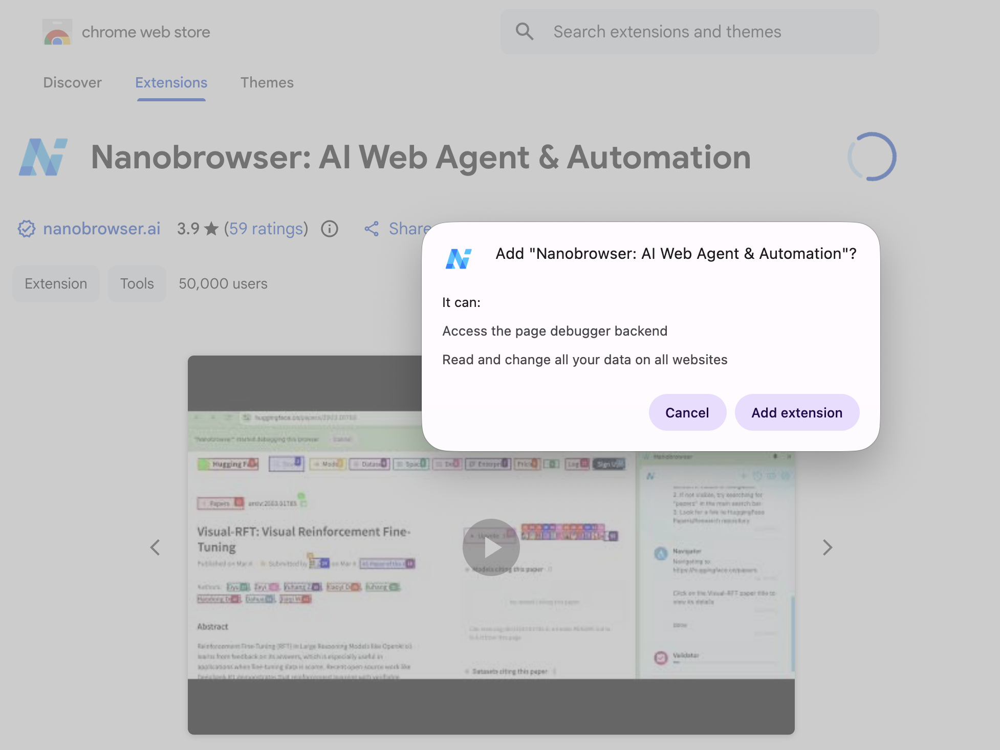
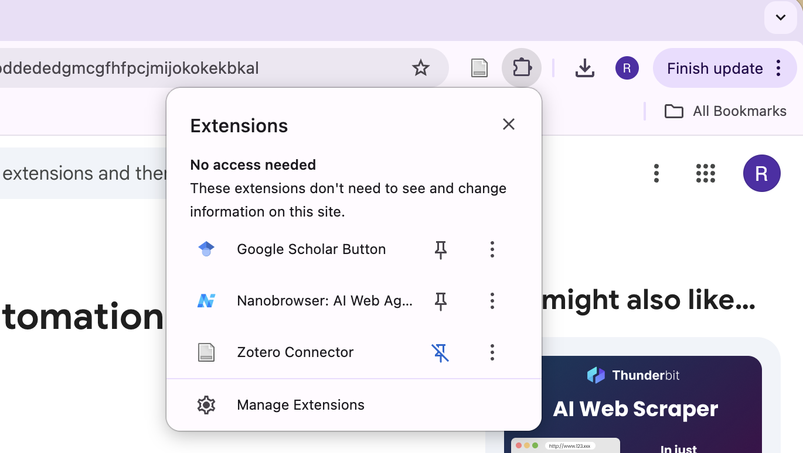
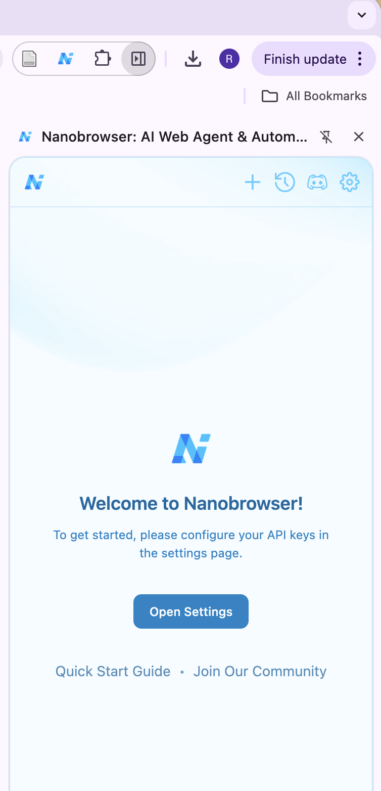
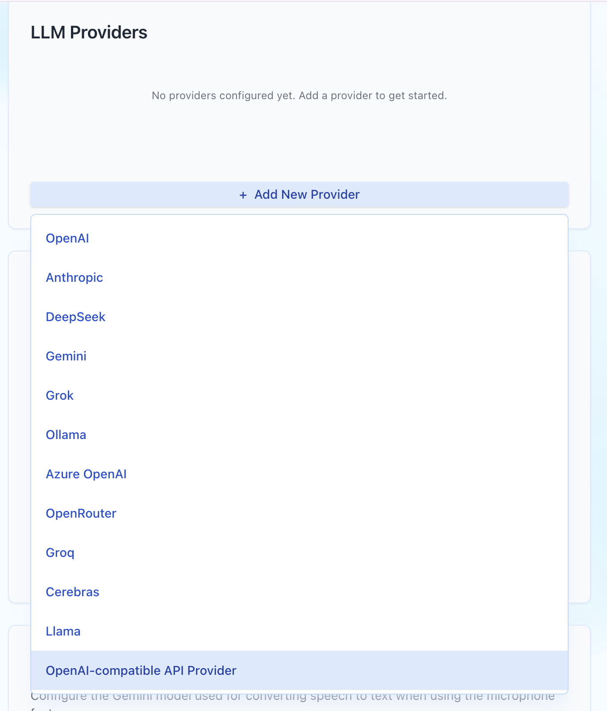
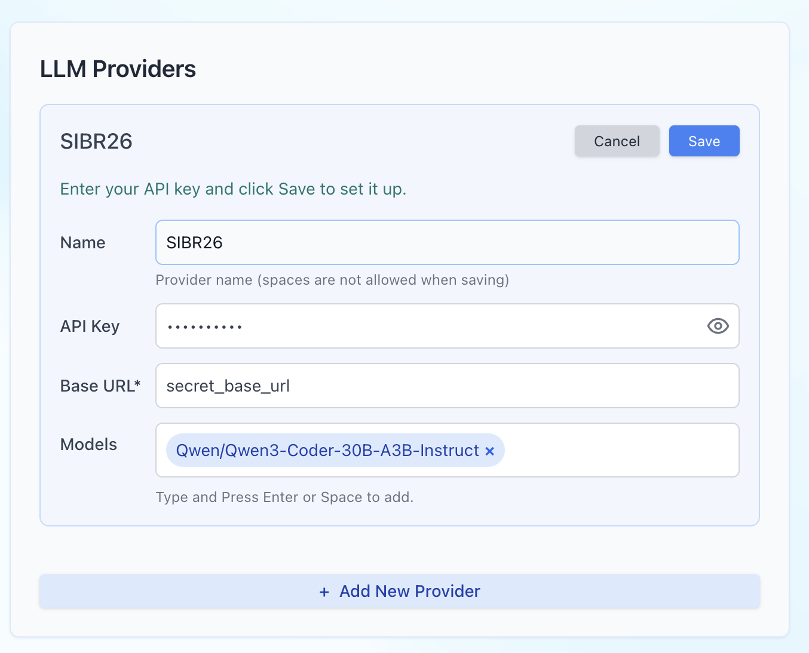
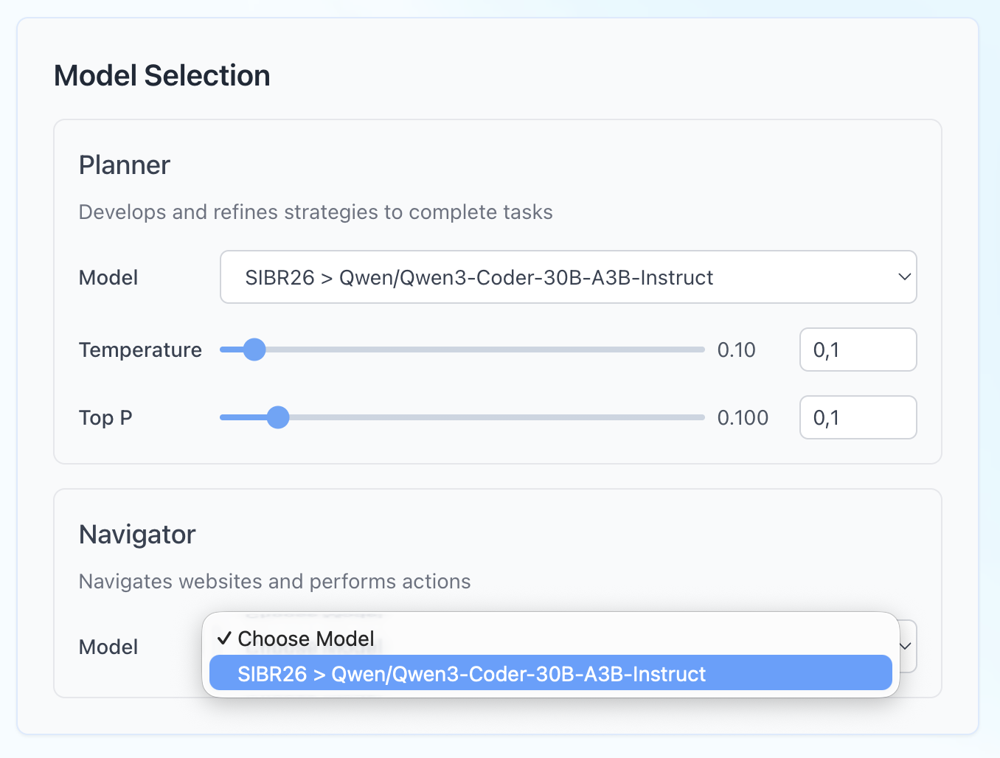

# SIBR 2026 LLM Pollution Workshop

This workshop is designed to help you get a hands-on sense of **LLM Pollution**, with a focus on understanding the capabilities of current agentic systems.

Through two short activities, you will:

- Experience a research survey as a normal participant would.
- See how an AI agent can be set up to complete that same survey on someone's behalf.
- Reflect on what what kinds of checks researchers might use to detect this kind of activity, and on what kind of changes we can try to implement at a broader scale.

---

## Repository structure

```
.
├── README.md                  <- you are here!
├── otree-app/                  <- the oTree implementation of our example survey (code/checks)
├── nanobrowser-demo/          <- prompt file used for Activity 2
└── slides/                      <- workshop slides
```

- **otree-app/**: Contains the survey application built with oTree. You can run this locally to explore the underlying code, including the different checks we implemented.
- **nanobrowser-demo/**: Contains the prompt that you will need to use for Activity 2.
- **slides/**: Workshop slides.

---

## Activity 1: Take the survey

Go through the survey below yourself. As you go through it, **pay attention to anything that might be designed to check whether a response was written by a human or by an LLM/agent**.

You have two options for accessing the survey: the deployed online version, or running it locally.

1. Open the following link in an **incognito tab** in your browser. Replace `REPLACE_WITH_YOUR_NAME` with your name or any code name:

   ```
   http://ai-fat-2025.xchm.org/room/ai_fat_2025?participant_id=REPLACE_WITH_YOUR_NAME
   ```

2. Go through the survey carefully.

3. As you go through it, keep an eye out for anything that seems designed to detect whether a response is LLM-mediated or generated by an agent.

---

## Activity 2: Set up Nanobrowser and run an AI agent on the survey

In this activity, you will set up **Nanobrowser**, a browser extension that allows an AI agent to control your browser and complete tasks, such as filling out the same survey from Activity 1.

### Step 1: Install Nanobrowser

1. Go to the Nanobrowser Chrome extension page:

   ```
   https://chromewebstore.google.com/detail/nanobrowser-ai-web-agent/imbddededgmcgfhfpcjmijokokekbkal
   ```



2. Click **Add to Chrome**.

3. Click **Add extension** to confirm.



4. Pin the Nanobrowser extension so it's easy to access. Click the puzzle-piece icon in your browser toolbar, then click the pin icon next to Nanobrowser.



### Step 2: Configure the API provider

1. Click on the Nanobrowser icon in your toolbar, then open **Settings**.



2. Click **Add new provider**.


3. Select **OpenAI-compatible API provider**.



4. Fill in the provider details as follows:
   - **Name:** `SIBR26`
   - **API Key:** the API key provided to you separately
   - **Base URL:** the link provided to you separately
   - **Models:** type `Qwen/Qwen3-Coder-30B-A3B-Instruct` and press Enter to add it

5. Click **Save**.



### Step 3: Select models

1. In the Nanobrowser settings, set both the **Planner** and **Navigator** models to:

   ```
   SIBR26 > Qwen/Qwen3-Coder-30B-A3B-Instruct
   ```



2. You do not need to adjust temperature or top-p for now. If time allows, feel free to experiment with these settings later.

### Step 4: Run the agent

1. Open `prompt.md` in the `nanobrowser-demo/` folder.

2. Copy the entire prompt.

3. Open the Nanobrowser side panel and paste the prompt into the chat/task box.

4. Run the task and observe how the agent navigates and completes the survey.


> **Note:** the prompt specifies a persona (a 77-year-old woman) for the agent to adopt. If you have extra time, feel free to experiment with changing this persona (e.g., age, gender) and observe whether it changes how the agent behaves.
